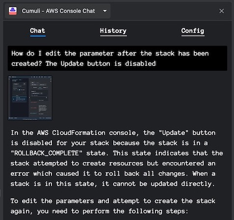

# Cumuli AWS Console Chat

Cumuli Chrome extension adds a side panel with LLM chat to all AWS pages, and lets you add screenshots of the console to your queries to get context-aware responses. It's similar to Amazon Q but uses GPT-4 Turbo with vision.

### Installation

Install on the [Chrome web store](https://chromewebstore.google.com/detail/cumuli-aws-console-chat/ekdfdahmkpbenhccafhdkmjfgcioejbc)

### Use cases

- AWS learners: Get unblocked by asking AI how to fix errors or use unfamiliar features.
- AWS professionals: Quickly resolve questions while prototyping, monitoring, or debugging.
- Everyone: Pair with AI without context-switching for increased productivity.

### Features

- AI Contextual Understanding: Pass screenshots as context to the language model.
- Conversation History: View previous messages and resend with edits.
- Adaptive UI: Dark and light mode theme selection is automatic based on your system settings.
- Convenient layout: Toggle Chrome's Side panel with a keyboard shortcut (Ctrl/Cmd + B suggested).

### Security & Privacy

The extension requests the minimum permissions required to function.

Calls to OpenAI API are made directly from the extension. Your data is never sent anywhere else and is stored locally in the extension-specific browser storage. The model does _not_ get context about your screen by default, and the screenshot feature is optional. OpenAI Terms and policies apply to the data you send to their API.

### Requirements

- An OpenAI account and an API key are required to use this extension (get your API key [here](https://platform.openai.com/api-keys)).
- Your OpenAI account must have access to the GPT-4 model. OpenAI automatically enables it in most cases, but it may be disabled if you never previously paid for the API. If that's the case, you can purchase $5 in credits [here](https://platform.openai.com/account/billing/overview), and that should automatically enable it.

### Cumuli vs. Amazon Q

Cumuli is a simple chat application with a focus on the core use case of easily sharing your screen with the LLM and getting contextual help.
Amazon Q cannot see your screen but has a lot more other capabilities and integrations. In terms of the model quality, Cumuli uses GPT-4 Turbo, which is the most capable LLM model available today. Amazon Q is powered by Bedrock, which has performance in the GPT-3.5 range (there are no official benchmarks for Amazon Q, so this is an estimate).

More comparisons below:

|                                  | Amazon Q                                     | Cumuli                           |
| -------------------------------- | -------------------------------------------- | -------------------------------- |
| Scope                            | Workplace assistant                          | AWS pages only                   |
| Price                            | Free while in preview, $20 or 25/month after | Pay-as-you-go OpenAI API pricing |
| LLM Model                        | Various, powered by Amazon Bedrock           | GPT-4 Turbo with vision          |
| Share your screen with the model | No                                           | Yes                              |
| Integration with AWS services    | Yes                                          | No                               |
| LLM can reference real articles  | Yes                                          | No                               |
| Open source                      | No                                           | Yes                              |

### Usage

1. Activate the extension

   Click on the extension icon or use a keyboard shortcut (Mac: `Cmd + B`, Windows/Linux: `Ctrl + B`) to open the Side panel. The extension can only be activated on AWS pages.

2. Add your OpenAI API key in the "Config" tab

3. Start chatting

   `Enter` key sends a text-only message. The model does _not_ get context about your screen by default. To include a screenshot with the message, press `Cmd + U` (Mac) or `Ctrl + U` (Linux/Windows).

### FAQ

- Why doesn't the keyboard shortcut work?

  The provided keyboard shortcuts are suggested defaults, and the bindings are handled by the browser. You can visit chrome://extensions/shortcuts and verify that the correct shortcuts are set for this extension. If there is a conflict with another extension, you can change the shortcuts to something else.

- I'm getting `` 404 The model `gpt-4-vision-preview` does not exist or you do not have access to it `` error.

  This means GPT-4 is not enabled for your account. You can purchase $5 in credits [here](https://platform.openai.com/account/billing/overview), and that should automatically enable it.

- Why doesn't clicking on the extension icon do anything?

  The extension can only be activated on AWS pages. These include the following domain namespaces:

  - `aws.amazon.com`
  - `amazonaws-us-gov.com`
  - `amazonaws.cn`
  - `aws.training`

    as well as the `.aws` top-level domain. It is disabled on all other pages.

- I have another issue not listed here or want to provide feedback.

  Please open an issue on GitHub or DM me on X: [@petrgazarov](https://twitter.com/PetrGazarov)
